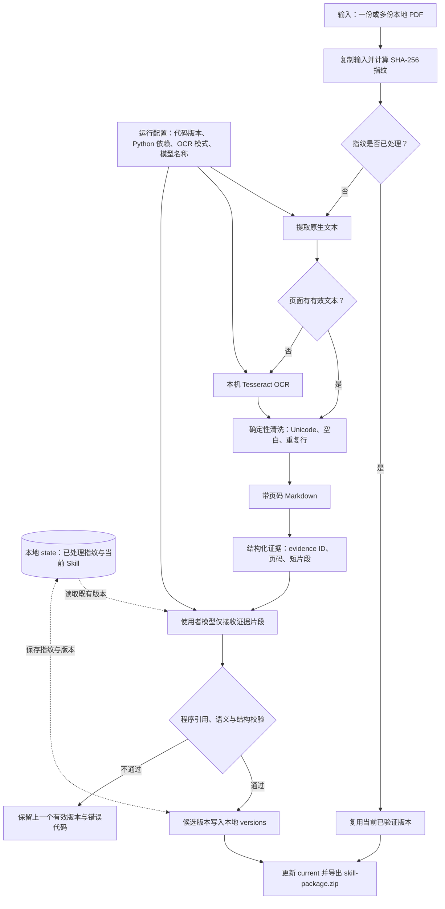

# robot-research-platform

机器人产业研究的公开展示平台与可复用本地工作流样例。

- 公开网站：[robot-research-platform.pages.dev](https://robot-research-platform.pages.dev/)
- 在线内容仅展示已发布的脱敏成果；不调用模型、后台 API 或 Worker。
- 本仓库不包含生产 PDF、生产 Skill、私有提示词、私有数据或任何密钥。

## 仓库内容

| 目录 | 用途 |
| --- | --- |
| [`portfolio-prototype/`](portfolio-prototype/) | 部署到 Cloudflare Pages 的纯静态公开展示站。 |
| [`public-workflow/`](public-workflow/) | 使用者在自己电脑上运行的 PDF→Skill 包命令行与 Streamlit 本地工作台。 |
| [`github-starter/`](github-starter/) | JSON→公开展示快照的最小可运行样例。 |

## PDF → Skill 包：当前能力

`public-workflow/` 一次可接收任意数量的本地 PDF，并输出一个 `skill-package.zip`。同一个本地 `--state` 目录会保存当前有效版本、版本历史和 PDF 指纹；后续加入新 PDF 时会在原有 Skill 基础上更新，重复 PDF 不会重复处理。

已实现的步骤：

1. 在本机提取 PDF 原生文本，进行确定性 Unicode、空白和连续重复行清洗，并落盘为带页码的规范化 Markdown。
2. 原生文本为空时，可使用本地 Tesseract OCR 生成同样的页码 Markdown；不会将 PDF 上传到 OCR 服务。
3. 从清洗文本中提取带 `evidence_id`、页码和片段的结构化证据索引，并只将这些证据片段发送到使用者自行配置的 OpenAI 兼容模型端点（兼容 DeepSeek 环境变量）。
4. 要求模型每项更新引用已有 evidence ID 和短引，程序核验引文与页码，再由模型逐项语义复核；之后校验固定父维度、操作引用、Skill 文件结构与敏感内容。失败时保留上一个有效版本。
5. 导出仅含 `skills/`、`SKILL.md`、`contract.json` 和 `references/` 的 ZIP 包；其中始终包含六个固定父维度的 Skill 目录，未获证据支持的子方法保持为空。

Markdown 与证据索引仅保存在使用者的本地 `--state` 目录，不写入 ZIP；扫描 PDF 需要本机安装 Tesseract。详情、安装、真实端点 smoke test 与故障排查见 [`public-workflow/README.md`](public-workflow/README.md)。

Codex、Hermes 等本地 agent 可遵循 [`public-workflow/AGENTS.md`](public-workflow/AGENTS.md) 的执行契约，使用同一命令行入口生成 ZIP。

本地工作台会自动启动两个本地 worker，并实时显示每份 PDF 的解析、OCR、证据、模型校验和 ZIP 导出进度；worker 与任务状态均保存在使用者电脑的本地队列中。

### 可复现的 PDF → Skill 工作流

下图描述的是可复现的工作流契约：相同的 PDF 指纹、固定的依赖与 OCR 配置会得到相同的本地 Markdown 和证据索引；模型只基于这些可追溯证据提出候选更新，程序校验后才写入版本。Cloudflare Pages 只托管公开展示页，不参与 PDF 解析、模型调用、任务排队或文件存储。



- 首次提交任务时会自动启动两个 worker。不同 `--state` 目录可并行处理；同一目录按顺序写入，避免覆盖同一套 Skill 的版本。队列只负责调度与实时状态，不改变上述输入、证据和版本契约。
- `jobs.sqlite3`、上传副本、带页码 Markdown、证据索引、版本历史和 ZIP 均留在本机。ZIP 只打包可复用的 Skill 文件，不含 PDF、密钥、路径、模型回复或本地状态。
- 任务状态依次包括排队、解析 PDF、OCR、证据提取、模型校验、导出 ZIP、完成或失败。工作台每秒刷新，因此可以看到每篇 PDF 的当前处理阶段和总完成数量。
- 不使用网页时，也可用 `job_cli.py submit` 提交任务、用 `job_cli.py status` 查询相同的 SQLite 状态；完整命令见 [`public-workflow/AGENTS.md`](public-workflow/AGENTS.md#后台任务与实时进度)。

## 本地运行

```powershell
git clone https://github.com/RebeccaJ79/robot-research-platform.git
cd robot-research-platform/public-workflow
python -m venv .venv
.\.venv\Scripts\python.exe -m pip install -r requirements.txt
.\.venv\Scripts\python.exe -m streamlit run local_workbench.py
.\.venv\Scripts\python.exe skill_cli.py --pdf .\report-a.pdf --pdf .\report-b.pdf --state .\local-state --output .\skill-package.zip --offline-updates .\sample-data\skill-updates.json
```

去掉 `--offline-updates` 后，需在本机环境设置 `MODEL_API_KEY`、`MODEL_BASE_URL`，以及可选的 `MODEL_NAME`；也可直接使用 `DEEPSEEK_API_KEY`、可选 `DEEPSEEK_BASE_URL` 和 `DEEPSEEK_MODEL`。密钥仅发送给使用者配置的模型端点，费用由使用者承担。

## 验证

```powershell
cd public-workflow
.\.venv\Scripts\python.exe -m pytest tests -q
```

测试覆盖增量更新、重复 PDF 去重、固定六父维度、无效候选版本回滚、敏感内容阻断和 ZIP 目录结构。

## 许可

[MIT License](LICENSE)
