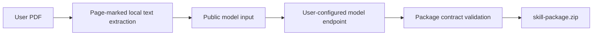

# Public PDF-to-Skill Package Design

## Goal

Allow a user to run the public project locally with their own PDF and model
credentials, then download one `skill-package.zip` whose `skills/` tree follows
the formal Task 4 Skill package layout. The public workflow must be runnable
without any production PDF, production Skill, private prompt, private database,
or platform credential.

## Boundary

The public module is a portable local CLI. Cloudflare Pages remains a static
showcase and links to the source and instructions; it never receives PDFs,
model keys, extracted text, or generated packages.

The CLI receives one local PDF and writes all transient files into a caller
selected work directory. Only the final zip is an intended output. The work
directory holds parsed text and model input only for the local run and is not
added to the zip.

The public module must not import `robot_evidence_pipeline`, read outside its
own directory, make assumptions about the robot industry, or reuse the
production Task 4 prompt. Its model request states only the public package
contract and asks for generalizable methods derived from caller-provided text.

## Package Contract

Each completed run creates exactly one `skill-package.zip` containing:

```text
skills/
  <skill-directory>/
    SKILL.md
    contract.json
    references/
      analysis-rules.yaml
      child-dimensions.yaml
      indicator-catalog.yaml
      research-model.yaml
      source-traceability.yaml
```

The top-level `skills/` directory can contain zero or more generated Skill
directories. A valid directory name is generated from the model's declared
display name after deterministic filename-safe normalization. Each Skill must
have a unique directory name.

The files mirror the formal package structure but their content is generated
only from the caller's PDF. `source-traceability.yaml` may identify the input
as `user-supplied-pdf` and page numbers, but it must not include a source path,
PDF hash, full quotation, API credential, private prompt, model response, or
machine-specific information.

`contract.json` must declare `skill_id`, `package_name`, `display_name`,
`version`, `child_dimension_ids`, `indicator_ids`, `decision_rule_ids`,
`references`, and `shared_report_formats`. The `references` entries must be
the five paths listed above. `SKILL.md` must have front matter with a name and
description. The five reference files must be valid YAML mappings.

## Processing Flow



The parser first extracts native text using a public dependency. If the PDF has
no meaningful native text, the CLI reports `PDF_TEXT_EXTRACTION_EMPTY`; it does
not upload the PDF to an OCR service. The first public release deliberately
does not support OCR because it would add an unpinned native dependency and
substantially reduce reproducibility.

Offline mode accepts a supplied structured fixture instead of calling a model,
so contributors can run the full package and zip validation without a key or
network access. Online mode reads `MODEL_API_KEY`, `MODEL_BASE_URL`, and the
optional `MODEL_NAME` from the caller's environment and sends the user text
only to the configured OpenAI-compatible endpoint.

## Validation and Failure Behavior

Validation happens before the zip is created. It rejects missing required
files, unsafe directory names, duplicate Skill IDs, invalid JSON, missing
front matter, malformed YAML mappings, a contract that references files outside
the Skill directory, and forbidden content such as credentials, absolute paths,
PDF paths, or private pipeline names.

On every failure, the CLI exits non-zero and does not leave a completed zip at
the requested destination. It may retain the caller-selected work directory for
local debugging, but its console output must not echo credentials or full model
responses.

## Documentation and Public Site

`public-workflow/README.md` documents the local command, user-owned model
costs, PDF/text limitations, package layout, and the rule that generated
packages stay on the user's computer. `portfolio-prototype` adds a static
“研报工作台” navigation item before “每日关注”; it explains the local workflow
and links to the repository instructions without providing upload controls.

## Verification

1. A fixture-driven offline run produces a zip with the exact directory and
   file contract above.
2. A validation test rejects an archive candidate containing a PDF path,
   credential pattern, or reference that escapes its Skill directory.
3. An online endpoint fixture proves the caller key is sent only to the
   configured endpoint.
4. A malformed model response cannot create a zip.
5. The public-material scan confirms the new module, examples, site files, and
   generated test artifacts contain no PDF, private source path, production
   Skill, credential, prompt, raw response, or database file.
