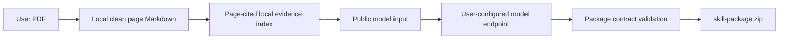

# Public PDF-to-Skill Package Design

## Goal

Allow a user to run the public project locally with any number of their own
robot-industry PDFs and model credentials, then download one versioned
`skill-package.zip`. Its `skills/` tree follows the formal Task 4 Skill package
layout and has the six fixed parent dimensions. The public workflow must be
runnable without any production PDF, production Skill, private prompt, private
database, or platform credential.

## Boundary

The public module is a portable local CLI. Cloudflare Pages remains a static
showcase and links to the source and instructions; it never receives PDFs,
model keys, extracted text, or generated packages.

The CLI receives one or more local PDFs and writes all transient files and its
local state into a caller-selected work directory. Each successful run writes a
new complete ZIP and atomically promotes its validated tree to the current
local version. The work directory holds parsed text, PDF fingerprints, model
input, prior versions, and candidate output; none are added to the ZIP.

The public module must not import `robot_evidence_pipeline`, read outside its
own directory, or reuse the production Task 4 prompt. It contains a public
taxonomy with exactly these stable parent IDs: `market-demand`,
`technology-product`, `supply-chain`, `commercialization`,
`company-fundamentals`, and `valuation-investment`. Its model request states
only the public package contract and asks for generalizable methods derived
from caller-provided text.

## Package Contract

Each completed run creates exactly one `skill-package.zip` containing:

```text
skills/
  <skill-directory>/
    SKILL.md
    contract.json
    references/
      analysis-rules.yaml
      child-dimensions.yaml
      indicator-catalog.yaml
      research-model.yaml
      source-traceability.yaml
```

The top-level `skills/` directory contains the fixed parent directories for
which a validated method exists. Their names are determined by the public
taxonomy, not by the model. New PDFs add, merge, deprecate, or revise child
dimensions, indicators, rules, and research models within their routed parent;
they never create a seventh parent Skill.

The files mirror the formal package structure but their content is generated
only from the caller's PDF. `source-traceability.yaml` may identify the input
as `user-supplied-pdf` and page numbers, but it must not include a source path,
PDF hash, full quotation, API credential, private prompt, model response, or
machine-specific information.

`contract.json` must declare `skill_id`, `package_name`, `display_name`,
`version`, `child_dimension_ids`, `indicator_ids`, `decision_rule_ids`,
`references`, and `shared_report_formats`. The `references` entries must be
the five paths listed above. `SKILL.md` must have front matter with a name and
description. The five reference files must be valid YAML mappings.

## Processing Flow



The parser first extracts native text using a public dependency, then applies
deterministic Unicode, whitespace and consecutive-line cleanup before writing
page-marked Markdown under the local state directory. It extracts stable,
page-cited evidence entries from that Markdown. If native text has no meaningful
content, the CLI runs local Tesseract OCR through pinned Python dependencies; it
never uploads the PDF to an OCR service. Missing OCR dependencies or a missing
Tesseract executable produce explicit remediation errors.

Offline mode accepts a supplied structured fixture instead of calling a model,
so contributors can run the full package, an incremental update, and ZIP
validation without a key or network access. Online mode reads `MODEL_API_KEY`,
`MODEL_BASE_URL`, and the optional `MODEL_NAME` from the caller's environment
and sends only the page-cited evidence fragments to the configured
OpenAI-compatible endpoint. Every proposed operation must cite valid local
evidence IDs before package validation can proceed.

Before generation, the CLI deduplicates PDFs using a local SHA-256 fingerprint
registry. It routes new content to the six fixed parents, gives the model only
the affected parent registries, and validates its proposed registry operations.
The supported operations are add, replace, merge, alias, and deprecate for
child dimensions, indicators, rules, and research models. Existing active
entries retain their stable IDs unless an explicit validated operation changes
them.

## Validation and Failure Behavior

Validation happens before the zip is created. It rejects missing required
files, a missing or unknown fixed parent ID, duplicate Skill IDs, invalid JSON,
missing front matter, malformed YAML mappings, a contract that references files
outside the Skill directory, and forbidden content such as credentials,
absolute paths, PDF paths, or private pipeline names.

On every failure, the CLI exits non-zero and does not leave a completed zip at
the requested destination. It may retain the caller-selected work directory for
local debugging, but its console output must not echo credentials or full model
responses.

## Documentation and Public Site

`public-workflow/README.md` documents the local command, user-owned model
costs, PDF/text limitations, package layout, and the rule that generated
packages stay on the user's computer. `portfolio-prototype` adds a static
“研报工作台” navigation item before “每日关注”; it explains the local workflow
and links to the repository instructions without providing upload controls.

## Verification

1. A fixture-driven offline run over multiple PDFs produces one ZIP with fixed
   parent directories and the exact file contract above.
2. A second offline run updates the existing parent registry while retaining
   unaffected parent packages and stable IDs.
3. A repeated PDF fingerprint causes no duplicate operation or new version.
4. A validation test rejects an archive candidate containing a PDF path,
   credential pattern, or reference that escapes its Skill directory.
5. An online endpoint fixture proves the caller key is sent only to the
   configured endpoint.
6. A malformed model response cannot create a ZIP or replace the current
   version.
7. The public-material scan confirms the new module, examples, site files, and
   generated test artifacts contain no PDF, private source path, production
   Skill, credential, prompt, raw response, or database file.
